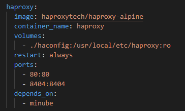

# CCSA: Práctica 1

#### Autor: ``Pablo Valenzuela Álvarez``

## 1. Entorno de desarrollo utilizado
Para la realización de esta práctica se usará el servicio de *Docker (4.28.0)*, *docker compose* para hacer el despliegue y *VSCode (1.87.2)* para editar el fichero correspondiente al compose. Por último, el sistema operativo que usaré es *Windows 11*. 

## 2. Descripción de la práctica

El objetivo de la práctica es desplegar un servicio **owncloud** siguiendo una de las arquitecturas propuestas.

En mi caso, se seguirá la estructura propuesta para el escenario segundo, donde tenemos que desplegar un servicio owncloud que contenga los siguientes elementos:
1. Servidor web **owncloud**.
2. Balanceador de carga, para el cual usaremos **HAProxy**.
3. **MariaDB**.
4. **Redis**.
5. Servicio de autenticación de usuario **LDAP**.

También se pide que se realice **replicación** sobre alguno de los microservicios expuestos anteriormente (owncloud, mariaDB o LDAP).

## 3. Servicios desplegados y su configuración

Para el despliegue se ha usado el siguiente fichero ([compose.yaml](compose.yaml)), que contiene los microservicios necesarios para completar los objetivos de la práctica. Las variables de entorno que se usan durante el proceso de despliegue se ubican en el fichero ([.env](.env)). 

A continuación, vamos a explicar la configuración que hemos dado a cada uno de los microservicios.

### 3.1. Servidor web owncloud (minube)

He decidido llamar al servicio de owncloud: **``minube``**. 

Como se puede ver en la siguiente imagen, esta diseñado para replicarse **tres veces** siguiendo una asignación de puertos del **8080** al **8082**. El servicio depende de otros dos: ``mariadb_slave`` y ``redis``, es decir, tiene que esperar a que estos dos servicios se construyan para poder funcionar bien. También usa el **volumen** de ``datos`` para persistir los archivos que los usuarios suban a la plataforma.

El valor de las **variables de entorno** usadas en la configuración de este servicio se puede ver en la siguiente imagen. Las variables muestran la versión del servicio, el dominio, los usuarios y contraseñas tanto de owncloud como de la base de datos, ... todo lo necesario para que el servicio funcione. 

**NOTA**: He decicido mantener el mismo usuario y la misma contraseña para todos los servicios que la requieran, aunque se recomienda que sean distintas.

### 3.2. Balanceador de carga HAProxy

Para el balanceador de carga se ha proporicionado un fichero de configuración [haproxy.cfg](haconfig/haproxy.cfg). Se le asigna el puerto **80**, donde se encargará de distribuir la carga entre los servicios de owncloud, y el puerto **8404**, que usaremos para monitorizar. Por último, este servicio espera a que ``minube`` (**owncloud**) este activo para funcionar.

En esta imagen se puede ver el contenido del fichero de configuración [haproxy.cfg](haconfig/haproxy.cfg). Destacar las últimas líneas donde podemos configurar el comportamiento que tendrá el backend cuando empiece a recibir peticiones de los clientes, en este caso y como modo de prueba, se asigna un máximo de cinco conexiones concurrentes a cada réplica.

### 3.2. Base de datos MariaDB

En la base de datos se ha usado una estrategia **maestro-esclavo**, de esta manera todo cambio ocurrido en la base de datos "*maestro*" se replica a la "*esclavo*". Para ello necesitaremos de dos servicios **MariaDB** y la configuración de estos es la siguiente:

#### 3.2.1. Maestro

Este servicio usa un fichero de configuración ([init_master.sql](sqlmaster/init_master.sql)) donde activaremos la replicación. También se le ha vinculado el volumen de ``mysql_master`` donde se guardara la base de datos.

Un dato importante que se puede observar en la línea *"comand"* de la siguiente foto, es la asignación del **server-id**, es importante que este número sea distinto al del *esclavo* para que ambos servicios funcionen correctamente.

Contenido de las variables de entorno para **MariaDB** ([.env](.env)).

Contenido del fichero [init_master.sql](sqlmaster/init_master.sql).

#### 3.2.2. Esclavo

Al igual que el anterior este servicio cuenta con un fichero de configuración ([init_slave.sql](sqlslave/init_slave.sql)), donde se le indica la base de datos que debe replicar. También tiene vinculado su propio volumen ``mysql_slave``.

Como en el caso anterior, también hay que especificar un id para el esclavo. Como se ha podido observar, el id del **maestro** es **1** y el de el **esclavo** **2**.

Contenido del fichero [init_slave.sql](sqlslave/init_slave.sql).

### 3.3. Redis

La configuración del servicio ``redis`` tiene una configuración predeterminada, donde se le incluye el volumen con el mismo nombre (``redis``).

### 3.4. Servicio de autenticación OpenLDAP + phpLDAPmin

El servicio de autenticación consta de dos contenedores: ``OpenLDAP``, que es un servicio de directorio de codigo abierto con amplio de soporte de la comunidad, y ``phpLDAPmin`` con el que podemos gestionar este directorio desde una interfaz web.

#### 3.4.1. OpenLDAP

``OpenLDAP`` utiliza el puerto **389** para acceder a los directorios de manera predeterminada, y el puerto **636** para proporcionar una capa de seguridad entre la comunicación cliente-servidor. Nosotros haremos uso del primero, pero no esta mal dejarlo definido por si queremos usarlo en el futuro.

También hay que copiar varios ficheros situados en la carpeta *data*, dicha carpeta se crea automáticamente al construir el servicio por lo que no tenemos que preocuparno por ella.

Contenido de las variables de entorno para ``OpenLDAP`` ([.env](.env)). En este fichero es importante, definir bien los datos de la *empresa* que son los que tenemos que usar para loguearnos y poder crear usuario en el servicio ``phpLDAPmin``

#### 3.4.2. phpLADPmin

En la configuración del servicio ``phpLDAPmin`` hay que cambiar el puerto de acceso, porque el que usa por defecto esta siendo ocupado por el servicio ``haproxy``. También hay configurarlo para que se inicie después de haber activado el directorio ``OpenLDAP``.

**NOTA**: Para loguearnos en este servicio tendremos que usar el usuario: *cn=admin,dc=minube,dc=com*.

Contenido de las variables de entorno para ``phpLDAPmin`` ([.env](.env)). 

## 4. Funcionamiento del servicio

Para poner en funcionamiento el servicio tenemos que ejecutar el comando *docker compose up -d* en el directorio donde tengamos el archivo [compose.yaml](compose.yaml). **Nota**: Algunas veces es necesario ejecutarlo varias veces hasta que las replicas de owncloud se activen correctamente.

La imagen anterior muestra los puertos de acceso que hemos asignado para cada servicio:

* **80**: Balanceador de carga de ``HAProxy``.
* **8404**: Monitor de ``HAProxy``.
* **389**: Acceso estandar de ``OpenLDAP``.
* **696**: Acceso seguro de ``OpenLDAP``.
* **7777**: Acceso a ``phpLDAPmin``.
* **8080**: Servidor owncloud ``Minube-1``.
* **8081**: Servidor owncloud ``Minube-3``.
* **8082**: Servidor owncloud ``Minube-2``.

### 4.1. Probando phpLDAPamin

Accedemos al servicio phpLDAPmin para crear un usuario (recordar poner el usuario: *cn=admin,dc=minube,dc=com* y contraseña: *1234*).

Creamos un grupo possix dentro del contenedor "*dc=minube,dc=com*" llamado **personal**.

Y dentro de este grupo, creamo al usuario con nombre *Juan Perez* (**jperez**) con contraseña "*jperez*".

El resultado final debe parecerse a la siguiente imagen.

### 4.2. Probando Owncloud - Minube

Antes de poder entrar con el usuario creado en el punto anterior, debemos activar dentro de owncloud la opción de **LDAP - Integration**. Para ello accedemos con la cuenta de administrador de owncloud (*admin/1234*).

Seguidamente tenemos que vincular el servicio de ``OpenLDAP`` con **owncloud**, indicando el nombre del servicio, puerto y usuario administrador como se indica en la siguiente imagen. Una vez hehco esto podemos acceder con cualquier usuario creado en OpenLDAP.

Si nos logueamos con el usuario *jperez* podemos acceder al servicio minube (owncloud) donde podemos subir archivos.

### 4.3. Probando la replicación de la base de datos MariaDB

En este último punto, probaremos si se ha replicado la base de datos del maestro al esclavo.

Para comprobarlo necesitamos acceder a los contenedores por medio de una terminal, o dos en el caso de la siguiente imagen.

Como se puede observar, la base de datos que hemos definido anteriormente llamada "**minube**", se ha replicado correctamente del maestro al esclavo.

## 5. Conclusiones

En esta práctica, hemos logrado desplegar con éxito un servicio de ownCloud utilizando una arquitectura basada en microservicios. Este despliegue incluye la configuración de varios servidorer web, un balanceador de carga, una base de datos MariaDB con replicación maestro-esclavo, un servicio Redis y un servicio de autenticación de usuarios LDAP.

Durante el proceso de configuración nos hemos enfrentado diversos problemas, como fueron la configuración correcta de los servicios para que interactúen entre sí, la definición de las variables de entorno para configurar los servicios y la resolución de conflictos en los puertos asignando a cada servicio que lo requiera uno distinto.

La replicación maestro-esclavo implementada en la base de datos MariaDB añade una capa de robustez y disponibilidad a nuestro sistema, permitiendo la redundancia de datos y la tolerancia a fallos en caso de que uno de los servidores falle.

En cuanto a la integración con LDAP, hemos demostrado la capacidad de ownCloud para trabajar con servicios de autenticación externos, lo cual facilita la gestión de usuarios y mejora la seguridad del sistema al centralizar la autenticación.

En resumen, esta práctica nos ha permitido adquirir y reforzar conocimientos en la implementación de servicios complejos en entornos de contenedores. Además, hemos explorado herramientas clave como Docker, Docker Compose, HAProxy y OpenLDAP, lo que nos ha proporcionado habilidades prácticas y conocimientos que son altamente relevantes en el mundo laboral actual. 

## 6. Referencias

[1] Guión de prácticas, (https://github.com/ccano/cc2223/blob/main/practice1/README.md)

[2] Replicación maestro-esclavo MariaDB, (https://mariadb.com/kb/en/setting-up-replication/)
